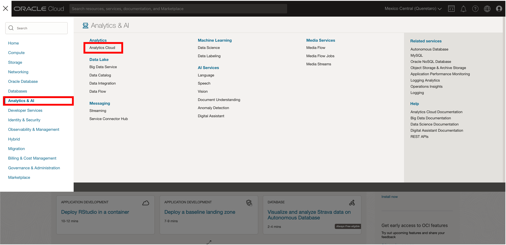
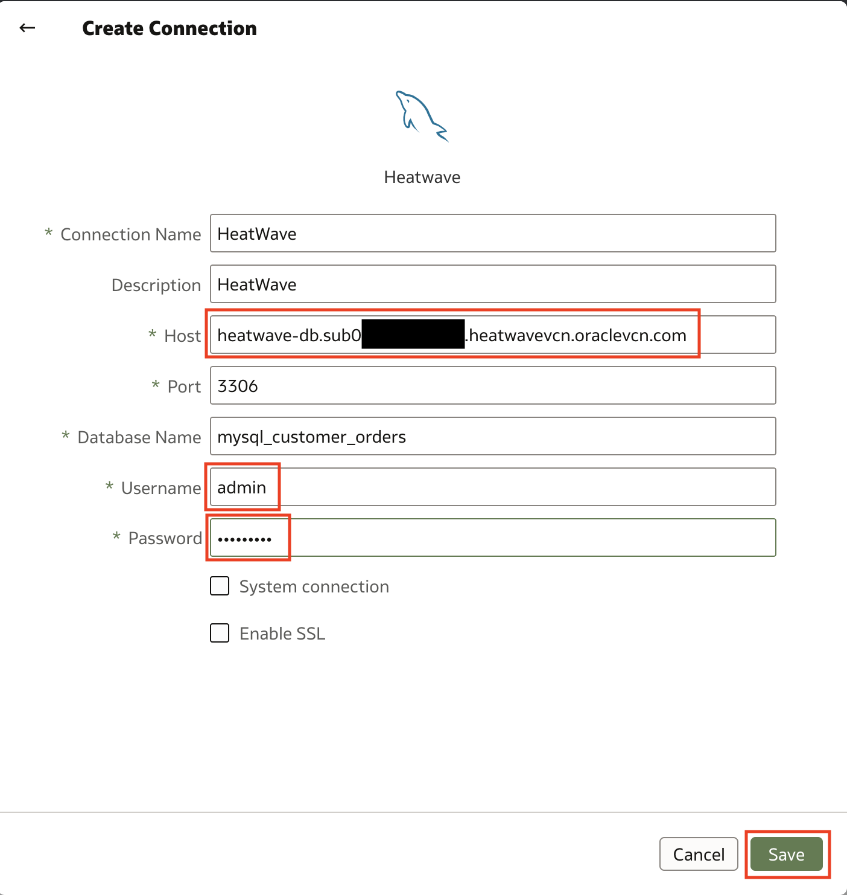
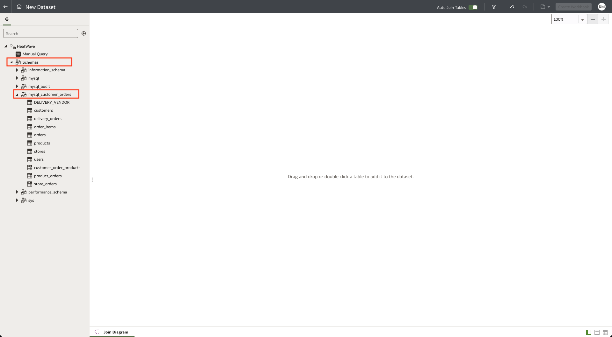
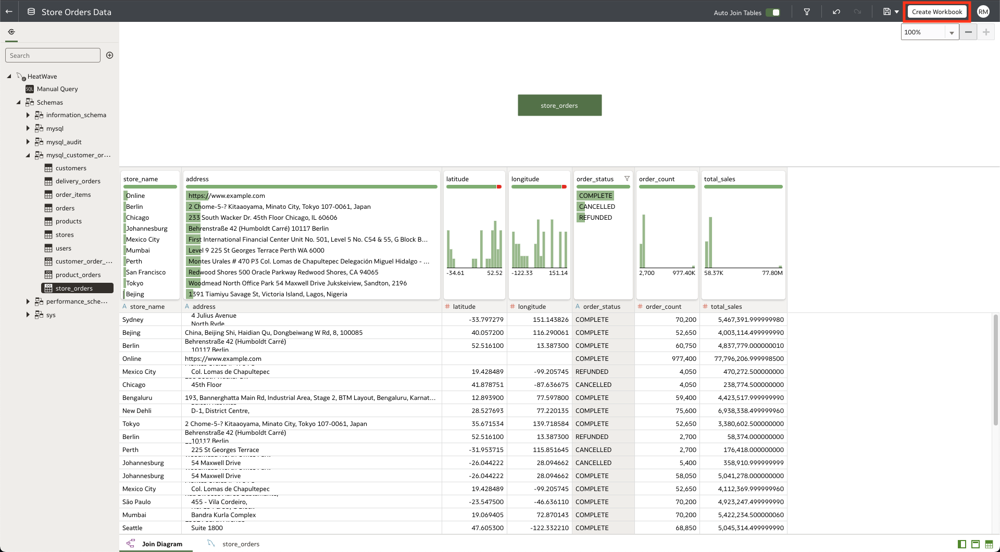

# Build a real-time dashboard in Oracle Analytics Cloud with MySQL HeatWave


## Introduction

MySQL HeatWave can easily be used for development tasks with existing Oracle services, such as Oracle Cloud Analytics. -> Oracle Analytics Cloud (OAC) provides the industry’s most comprehensive cloud analytics in a single unified platform, including self-service visualization and inline data preparation to enterprise reporting, advanced analytics, and self-learning analytics that deliver proactive insights.

Use MySQL HeatWave with OAC to explore and perform collaborative analytics with your MySQL data.

_Estimated Time:_ 20 minutes


### Objectives

In this lab, you will be guided through the following tasks:

- Create Oracle Analytics Cloud and connect to MySQL HeatWave
- Create a dashboard on OAC for the delivery-orders

### Prerequisites

- An Oracle Trial or Paid Cloud Account
- Some Experience with MySQL Shell
- Completed Lab ______

## Task 1: Create an Oracle Analytics Cloud Instance

1. From the OCI Console, nagivate to Analytics & AI > Analytics Cloud
    

2. Select the **lakehouse** Compartment and Click the **Create Instance** button
    
    
3. On the Create Analytics Instance enter the required information as shown below

    Name:
     ```bash
    <copy>hwoac</copy>
     ```

    Description:
    ```bash
    <copy>Oracle Analytics Cloud HeatWave Test</copy>
     ```

    Capacity: Select **OCPU** and select **1**

    License and Edition:
        - Select **License Included**
        - Select **Enterprise Edition**

4. Click the **Create** button
    

5. It takes about 12-15 minutes for the OAC instance creation to complete
    

## Task 2: Configure Private Access Channel

1. Go down to the “Private Access Channel” resources page and click on the **Configure Private Access Channel** button.

2. Click the **Create Private Access Channel** button

3. On the create Private Access Channel page enter the following:

    Name:
    ```bash
    <copy>hwoacpac</copy>
     ```

     DNS Zones: **Check Virtual Cloud Network's domain name as DNS zone (hwvcn.oraclevcn.com)**

    Description:
    ```bash
    <copy>Testing</copy>
     ```

     **Remove second DNS Zone entry**
    

4. Click the **Configure** button

5. Wait 15 minutes for the configuration process to complete before proceeding to Task 3.
    

## Task 3: Get HeatWave DB Hostname

1. Before we start, go to Menu > Databases > DB Systems

2. Select HeatWave database: **heatwave-db**

3. Click on the "Connections" tab on the Endpoints > Internal FQDN > Click on the Copy link.
    

4. Save the Hostname in your notepad for use with OAC
    Example: **hwdb.sub09012...hwvcn.oraclevcn.com**

## Task 4: Create Connection from HeatWave DB to OAC

1. Navigate to Menu > Analytics > Analytics Clouds

2. Select the OAC instance you provisioned to access the OAC console by clicking on Analytics Home Page. Click on the "Analytics Home Page" button.
    

3. Create a Connection to HeatWave to build a dashboard
    

4. Click the "Create Connection" button
    

5. Search for HeatWave and select HeatWave as the database.
    

6. Specify the connections details
    - Specify the hostname of heatwave-db
    - Use the FQDN information you save in Step 3
    - Port: 3306
    - Database Name: mysql_customer_orders
    - Be sure to use the Heatwave DB username and password

    Hit the "Save" button to fisnish creating the connection.
    

7. The completed connection will display a "New Dataset" page. Click on the "Schemas" link and select the "mysql_customer_orders" schema
    

## Task 5: Use OAC to Analyze the store_orders table data

1. Drag and drop the store_orders table from the sidebar into the **New Dataset** page.
    

2. Save the dataset and specify name.
    

3. In the top right corner, click the **Create Workbook** button.
    

4. Drag and drop **store_name** and **total_sales** into the visualization area. We are only interested in these values as we will be creating a heatmap to visualize total sales by store location. 
    

5. Click on the **Pick Visualization** button and select the **Map** visualization.
    

6. Ensure that **store_name** is under the **Category (Location)** header and **total_sales** is under **Color**.
    

7. We want to exclude Online orders from the heatmap of store orders. In the map visualization, right click on the **Online** bubble and select **Remove Selected**.
    

Your final visualization should look like this: 
    

8. Save the workbook as "store_total_sales".

9. Let's review our map and determine how it can be used to aggregate total sales by country or by region. 


**Congratulations! You have successfully finished the Lab. Please proceed to the next lab.**


## Acknowledgements

- **Author** - Runit Malik, MySQL Cloud Solution Engineer
- **Contributors** - Perside Foster, MySQL Principal Solution Engineer
- **Last Updated By/Date** - Runit Malik, MySQL Cloud Solution Engineer, September 2023