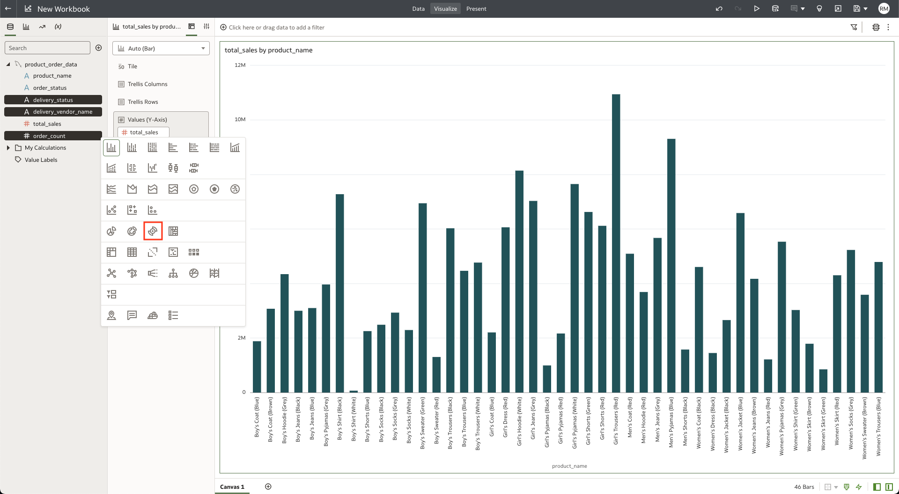

# Build a real-time dashboard in Oracle Analytics Cloud with MySQL HeatWave

## Introduction

MySQL HeatWave can easily be used for development tasks with existing Oracle services, such as Oracle Cloud Analytics. -> Oracle Analytics Cloud (OAC) provides the industry’s most comprehensive cloud analytics in a single unified platform, including self-service visualization and inline data preparation to enterprise reporting, advanced analytics, and self-learning analytics that deliver proactive insights.

Use MySQL HeatWave with OAC to explore and perform collaborative analytics with your MySQL data.

_Estimated Time:_ 20 minutes

### Objectives

In this lab, you will be guided through the following tasks:

- Create a heatmap on OAC for the store_orders table
- Create a sunburst chart on OAC for the delivery_orders and DELIVERY_VENDORS tables

### Prerequisites

- An Oracle Trial or Paid Cloud Account
- Some Experience with MySQL Shell
- Completed Lab 8

## Task 1: Create Connection from HeatWave DB to OAC

1. Navigate to Menu > Analytics > Analytics Clouds

2. Select the OAC instance you provisioned to access the OAC console by clicking on Analytics Home Page. Click on the **Analytics Home Page** button.
    

3. Create a Connection to HeatWave to build a dashboard
    

4. Click the **Create Connection** button
    

5. Search for HeatWave and select HeatWave as the database.
    

6. Specify the connections details
    - Specify the hostname of heatwave-db
    - Use the FQDN information you save in Step 3
    - Port: 3306
    - Database Name: mysql\_customer\_orders
    - Be sure to use the Heatwave DB username and password

    Hit the **Save** button to fisnish creating the connection.
    

7. The completed connection will display a "New Dataset" page. Click on the **Schemas** link and select the **mysql\_customer\_orders** schema
    

## Task 2: Use OAC to Analyze the store_orders table data

1. Drag and drop the **store\_orders** table from the sidebar into the **New Dataset** page.
    

2. Save the dataset and specify name.
    

3. In the top right corner, click the **Create Workbook** button.
    

4. Drag and drop **store\_name** and **total\_sales** into the visualization area. We are only interested in these values as we will be creating a heatmap to visualize total sales by store location. 
    

5. Click on the **Pick Visualization** button and select the **Map** visualization.
    

6. Ensure that **store\_name** is under the **Category (Location)** header and **total\_sales** is under the **Color** header.
    

7. We want to exclude Online orders from the heatmap of store orders. In the map visualization, right click on the **Online** bubble and select **Remove Selected**.
    

Your final visualization should look like this: 
    

8. Save the workbook as "store\_total\_sales".

9. Let's review our map and determine how it can be used to aggregate total sales by country or by region. 

## Task 3: Use OAC to Analyze the delivery orders and DELIVERY VENDORS tables

1. From the Oracle Analytics Cloud Homepage, click on the **HeatWave** Connection we created earlier in the lab.
    

2. From the list of tables under **mysql\_customer\_orders**, drag and drop the **DELIVERY\_VENDOR** and **delivery\_orders** tables.
    

3. Right click on the **DELIVERY\_VENDORS** table, click "Join To" and select the **delivery\_orders** table.
    

4. Select the **id** column under the **DELIVERY\_VENDOR** table and the **delivery\_vendor\_id** column under the **delivery_orders** table.
    

5. In the top right corner, click **Create Workbook**.
    

6. From the **DELIVERY\_VENDOR** table, drag and drop the **vendor\_name** column into the visualization area. From the **delivery\_orders** table, drag and drop the **order\_id** and **order\_status** columns. The visualization area will have a loading screen, please move to the next step.
    

7. Right click on **order\_id** under "Rows", select **Aggregate** and then **Count**.
    

8. Click on the **Pick Visualization** button and select the **Sunburst** visualization.
    

9. Ensure that **COUNT order\_id** is under the **Values (Slice Size)** header, **vendor\_name** and **order\_status** are under the **Category (Slices)** header. If the vendor\_name column is listed below order\_status under the Category (Slices) header, drag it above the order\_status column.
    

10. Drag and drop **vendor\_name** under the **Color** header. Your final visualization should like this:
    

11. The Sunburst Visualization helps us to aggregate the orders and separate order status by the 6 delivery vendors to show us the ratio of completed orders to orders that were canceled or refunded.

12. Save the workbook as "vendor\_order\_status".

**Congratulations! You have successfully finished the Lab. Please proceed to the next lab.**

## Acknowledgements

- **Author** - Runit Malik, MySQL Cloud Solution Engineer
- **Contributors** - Perside Foster, MySQL Principal Solution Engineer
- **Last Updated By/Date** - Runit Malik, MySQL Cloud Solution Engineer, September 2023